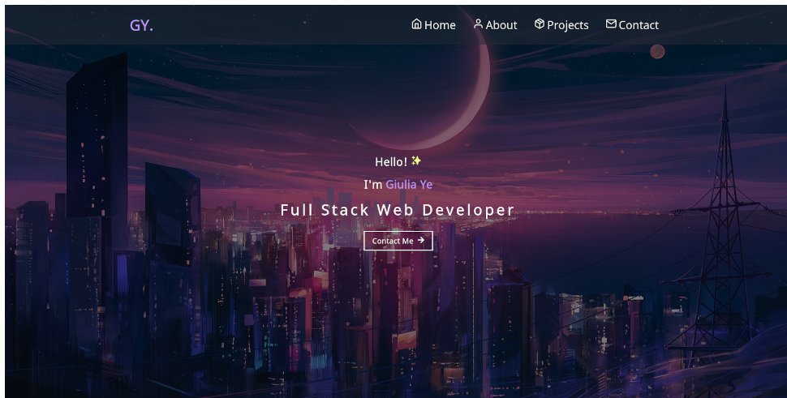

<p align="left">
   
</p>

# portfolio v1

---

<p align="center">
   
</p>

<p align="center">
   <a href="https://giuxtaposition.github.io/portfolio-v1">Go check it out 🎉</a>
</p>

---

# :pushpin: Table of Contents

- [:pushpin: Table of Contents](#pushpin-table-of-contents)
  - [Running Locally](#running-locally)
  - [Built With](#built-with)
  - [License](#license)
  - [Contact](#contact)

## Running Locally

``` bin/bash
git clone https://github.com/giuxtaposition/portfolio-v1.git
cd portfolio-v1
yarn install
yarn start
```

## Built With

- React.js (HTML, CSS, Typescript)
- Sass
- NodeJs and Express for the backend of the Contact Form

## License

Distributed under the MIT License. See `LICENSE` for more information.

## Contact

Giulia Ye - yg97.cs@gmail.com
Project Link: https://giuxtaposition.github.io/portfolio-v1
